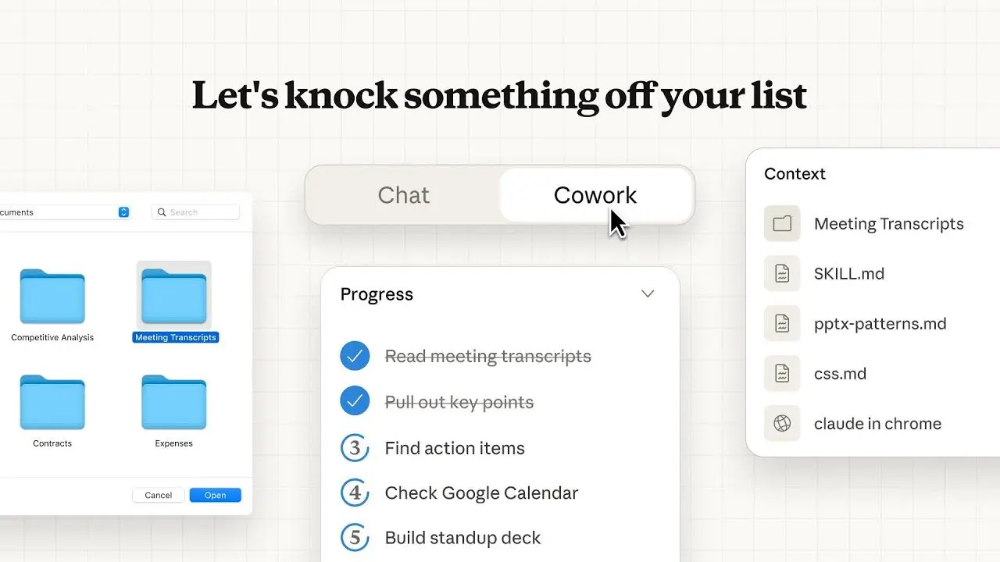

<p align="center">
  <a href="https://github.com/coasty-ai/open-cowork">
    
  </a>
</p>

<h1 align="center">open-cowork</h1>

<p align="center">
  <strong>Hand off computer tasks to an AI coworker — watch it work, approve from anywhere.</strong>
</p>
<p align="center">
  An open-source, cross-platform agentic coworker on the
  <a href="https://coasty.ai/docs">Coasty Computer Use API</a>.
  It <em>sees a screen and acts on it</em> — your own desktop, a cloud VM, or a browser —
  streams every step live, pauses for your approval, and keeps spend visible and capped.
</p>

<p align="center">
  <a href="https://github.com/coasty-ai/open-cowork/actions"></a>
  
  
  
  
  
</p>

<p align="center">
  <a href="#quickstart"><b>Quickstart</b></a> &nbsp;·&nbsp;
  <a href="RUN_LOCALLY.md"><b>Automate your PC</b></a> &nbsp;·&nbsp;
  <a href="#what-you-can-do"><b>Features</b></a> &nbsp;·&nbsp;
  <a href="#how-it-works"><b>How it works</b></a> &nbsp;·&nbsp;
  <a href="#docs">Docs</a>
</p>

---

## Quickstart

> **Prereqs:** Node ≥ 22.5 (we use 24) · pnpm 10 (`corepack enable`).

```bash
git clone https://github.com/coasty-ai/open-cowork.git && cd open-cowork
pnpm install      # one install for the whole monorepo
pnpm dev          # mock Coasty + backend + web, all wired — zero config
```

`pnpm dev` with **no configuration at all** runs in **demo mode**: it boots the
bundled mock Coasty server and the backend uses an ephemeral sandbox key — no
account, no key, no network calls, no billing.

Then open **<http://127.0.0.1:5173>** → sign in with any email → **Machines →
Provision machine** (instant sandbox VM) → **Delegate** → type a task → confirm
the cost → watch it run. Add `NEEDS_HUMAN` anywhere in the task to see the
approval flow pause and resume. (`pnpm doctor` confirms your setup first.)

### Three ways to run

| | Command | Coasty key | Cost |
| --- | --- | --- | --- |
| **Try it (demo)** | `pnpm dev` | none — bundled mock | **$0** |
| **Your account** | set `COASTY_API_KEY` in `.env`, then `pnpm dev` | sandbox `sk-coasty-test-…` | **$0** (real model, never bills) |
| **Automate your own PC** | `pnpm dev` + `pnpm dev:desktop` | sandbox key | **$0** |

The **only** thing you ever configure is `COASTY_API_KEY` — everything else
(session secret, ports, base URL, DB) has a working default. Want the agent to
drive **your real mouse and keyboard**? That's the desktop app —
**[RUN_LOCALLY.md](RUN_LOCALLY.md)** walks you through it step by step.

<details>
<summary><b>Using your own Coasty account, webhooks &amp; the cost warning</b></summary>

```bash
echo "COASTY_API_KEY=sk-coasty-test-…" > .env   # sandbox key — never bills
pnpm dev                                         # now talks to the real Coasty API
```

With a key set, `pnpm dev` does **not** start the mock and points the backend at
the real Coasty API. Start with a **sandbox key** (`sk-coasty-test-…`) — it
exercises the full real model and never bills. Switch to a live key only when
you're ready to spend.

**Webhooks** (instant status without polling) require an **https**
`COWORK_PUBLIC_URL` — Coasty only accepts HTTPS webhook URLs. open-cowork
detects this: over a non-https URL it simply doesn't register a webhook (so run
creation never fails) and state still syncs live via SSE + read-time reconcile.
Set an https `COWORK_PUBLIC_URL` (a tunnel or your deployment — see
[DEPLOYMENT.md](DEPLOYMENT.md)) to turn webhooks on.

> ⚠ **Cost warning.** With a **live** key (`sk-coasty-live-…`): runs bill
> **$0.05/step**, machines **$0.05–0.09/hour** running ($0.01 stopped),
> predict/session calls a few cents each. open-cowork always shows an estimate,
> requires explicit confirmation, enforces per-run budget caps server-side, and
> supports machine auto-terminate TTLs — but a live key is real money. All
> automated tests use the mock/sandbox path and never spend anything.

</details>

### Other apps

```bash
pnpm dev:desktop   # Electron — local screen control (run `pnpm dev` first)
pnpm dev:mobile    # Expo / React Native  (or: pnpm --filter @open-cowork/mobile web)
```

---

## What you can do

- 💬 **Delegate in chat** — *"rename these files and email the report"* — and
  watch the agent execute it step by step with a live screen view.
- 📺 **Supervise runs** — dashboard, durable event timeline (SSE with replay),
  cancel / resume / human-takeover from web, desktop, or phone.
- 🔁 **Build workflows** — a versioned JSON DSL (task · assert · if · loop ·
  parallel · retry · human_approval) with instant validation, cost estimates,
  and hard server-side budget caps.
- 🖥️ **Manage machines** — provision Coasty cloud VMs, snapshot, stop,
  terminate, with live cost rates at every step.
- 📱 **Stay in the loop across devices** — start a run on your laptop; when it
  pauses for approval, the banner pops on your phone. Approve there.
- 💸 **See cost at all times** — wallet balance, per-run worst-case estimates,
  and an explicit *confirm-the-cost* handshake before anything billable starts.

### Platform support

| Capability | 🖥️ Desktop | 🌐 Web | 📱 Mobile |
| --- | :---: | :---: | :---: |
| Local screen control | ✅ first-class | → cloud machine | → cloud machine |
| Cloud-machine control + live view | ✅ | ✅ | ✅ |
| Task chat + run dashboard | ✅ | ✅ | ✅ |
| Workflow builder | ✅ full | ✅ full | view + approve |
| Approvals / human takeover | ✅ | ✅ | ✅ |
| Cost / wallet view | ✅ | ✅ | ✅ |

---

## How it works

```text
 You ──► open-cowork backend ──► Coasty API ──► a screen the agent drives
            │   (the ONLY place           ├─ your own desktop   (desktop app)
            │    the API key lives)       ├─ a Coasty cloud VM  (any client)
            └──► web / desktop / mobile   └─ a browser page     (Playwright)
                 live events, approvals, costs
```

One shared **agent loop** (screenshot → predict → act → repeat) drives any
screen through a single `Executor` interface — `LocalExecutor` (your desktop),
`RemoteMachineExecutor` (a cloud VM), or `BrowserExecutor`. Clients never hold
the Coasty key: they talk to the backend with short-lived session tokens, and
the backend proxies to Coasty, verifies HMAC-signed webhooks, persists runs, and
fans events out over SSE. Full design in
**[ARCHITECTURE.md](ARCHITECTURE.md)**.

## Security

`COASTY_API_KEY` exists **only** in the backend's environment. Browsers,
Electron renderers, and the mobile app authenticate with short-lived session
tokens and never see the key — enforced by tests that scan every client bundle
and a runtime E2E assertion that watches every browser request for secret
material. Coasty webhooks are verified with per-run HMAC secrets (constant-time
compare, ±5-minute replay window) before they can touch any state. Threat notes
in **[SECURITY.md](SECURITY.md)**.

---

## Docs

| Guide | What's inside |
| --- | --- |
| **[RUN_LOCALLY.md](RUN_LOCALLY.md)** | Automate your own PC with the desktop app — step by step |
| [ARCHITECTURE.md](ARCHITECTURE.md) | Monorepo map, the Executor abstraction, agent loop, realtime + data model |
| [SECURITY.md](SECURITY.md) | Key custody, HMAC, trust boundary, threat table |
| [DEPLOYMENT.md](DEPLOYMENT.md) | Running the backend + each client in production |
| [COOKBOOK.md](COOKBOOK.md) | Recipes: cross-device approval, workflows, scripting the loop |
| [DECISIONS.md](DECISIONS.md) · [CONTRIBUTING.md](CONTRIBUTING.md) · [SUMMARY.md](SUMMARY.md) | Stack choices · how to contribute · what was built + coverage |

### Project layout

```text
packages/core       Coasty client, agent loop, workflow DSL, cost estimator, HMAC — isomorphic, zero deps
packages/executor   Executor abstraction: LocalExecutor (native), RemoteMachineExecutor (VM), BrowserExecutor
packages/ui         Shared React design system + domain components
apps/backend        Fastify: auth, Coasty proxy (sole key holder), webhooks, SQLite, SSE fan-out, budgets
apps/web            Vite + React SPA (also hosted by the desktop shell)
apps/desktop        Electron shell + LocalRunManager (local screen control)
apps/mobile         Expo / React Native companion (monitor + approve)
tools/mock-coasty   Full offline mock of the Coasty API (REST + SSE + signed webhooks)
e2e                 Playwright end-to-end flows (web + desktop)
```

### Commands

| Command | What |
| --- | --- |
| `pnpm dev` | mock + backend + web, wired together (`--no-web` for API only) |
| `pnpm doctor` | preflight: Node, deps, key shape |
| `pnpm test` | every unit + integration suite (offline, no spend) |
| `pnpm typecheck` · `pnpm lint` · `pnpm format` | strict static checks |
| `pnpm e2e` | Playwright: web + desktop journeys vs the mock |
| `pnpm security:scan` | assert no secret material in client code/bundles |
| `pnpm dev:mock\|backend\|web\|desktop\|mobile` | run any single piece |

---

## Links

- **Repository:** <https://github.com/coasty-ai/open-cowork>
- **Issues & feature requests:** <https://github.com/coasty-ai/open-cowork/issues>
- **Report a vulnerability:** [Security Advisories](https://github.com/coasty-ai/open-cowork/security/advisories) (see [SECURITY.md](SECURITY.md))
- **Coasty:** [docs](https://coasty.ai/docs) · [API keys](https://coasty.ai/developers/keys)

## License

[MIT](LICENSE) © Coasty / open-cowork contributors
