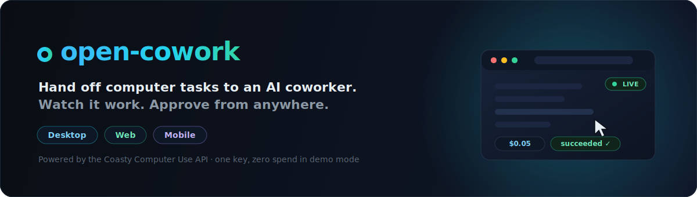

<p align="center">
  <a href="https://github.com/coasty-ai/open-cowork">
    
  </a>
</p>

<p align="center">
  <strong>An open-source, cross-platform agentic coworker on the
  <a href="https://coasty.ai/docs">Coasty Computer Use API</a>.</strong><br>
  Hand a task to an AI agent that <em>sees a screen and acts on it</em>, watch it work live,
  approve the sensitive steps from any device, and keep every cent of spend visible and capped.
</p>

<p align="center">
  <a href="https://github.com/coasty-ai/open-cowork/actions"></a>
  
  
  
  
</p>

```text
 You ──► open-cowork backend ──► Coasty API ──► a screen the agent drives
            │   (the ONLY place           ├─ your own desktop   (desktop app)
            │    the API key lives)       ├─ a Coasty cloud VM  (any client)
            └──► web / desktop / mobile   └─ a browser page     (Playwright)
                 live events, approvals, costs
```

## What you can do

- **Delegate a task in chat** — "rename these files and email the report" — and
  watch the agent execute it step by step with a live screen view.
- **Supervise runs** — dashboard, durable event timeline (SSE with replay),
  cancel / resume / human-takeover from web, desktop, or phone.
- **Build workflows** — a versioned JSON DSL (task / assert / if / loop /
  parallel / retry / human_approval) with instant validation, cost estimates,
  and hard server-side budget caps.
- **Manage machines** — provision Coasty cloud VMs, snapshot, stop, terminate,
  with live cost rates at every step.
- **Stay in the loop across devices** — start a run on the laptop; when it
  pauses for approval, the banner appears on your phone. Approve there.
- **See cost at all times** — wallet balance, per-run worst-case estimates, and
  an explicit *confirm-the-cost* handshake before anything billable starts.

| Capability | Desktop | Web | Mobile |
| --- | --- | --- | --- |
| Local screen control | ✅ first-class | ❌ → cloud machine | ❌ → cloud machine |
| Cloud-machine control + live view | ✅ | ✅ | ✅ |
| Task chat + run dashboard | ✅ | ✅ | ✅ |
| Workflow builder | ✅ full | ✅ full | ✅ view + approve |
| Approvals / human takeover | ✅ | ✅ | ✅ |
| Cost / wallet view | ✅ | ✅ | ✅ |

## Quickstart — one command, zero spend

Prereqs: **Node ≥ 22.5** (we use 24) and **pnpm 10** (`corepack enable`).

```bash
git clone https://github.com/coasty-ai/open-cowork.git && cd open-cowork
pnpm install      # one install for the whole monorepo
pnpm doctor       # optional: confirms you're ready
pnpm dev          # starts the mock Coasty server + backend + web, all wired
```

That's it. `pnpm dev` with **no configuration at all** runs in **demo mode**:
it boots the bundled mock Coasty server and the backend uses an ephemeral
sandbox key against it — no account, no key, no network calls, no billing.

Open http://127.0.0.1:5173 → sign in with any email → **Machines → Provision
machine** (instant sandbox VM) → **Delegate** → type a task → confirm the cost
→ watch it run. Add ` NEEDS_HUMAN ` anywhere in the task text to see the
approval flow pause and resume.

Desktop (Electron, local screen control): `pnpm dev:desktop` (with `pnpm dev`
running). Mobile (Expo): `pnpm dev:mobile`, or `pnpm --filter
@open-cowork/mobile web` for the browser-hosted build. See each app's README.

### Use your own Coasty account (still just one key)

The **only** thing you ever need to configure is the Coasty key:

```bash
echo "COASTY_API_KEY=sk-coasty-test-…" > .env   # sandbox key — never bills
pnpm dev                                         # now talks to the real Coasty API
```

Everything else (session secret, ports, base URL, DB path) has a working
default — the session secret is auto-generated. With a key set, `pnpm dev`
talks to the real Coasty API and does **not** start the mock. Start with a
**sandbox key (`sk-coasty-test-…`)** — it exercises the full real API and never
bills. Switch to a live key only when you're ready to spend.

Webhooks (instant status without polling) require an **https**
`COWORK_PUBLIC_URL` — Coasty only accepts HTTPS webhook URLs. open-cowork
detects this: against the real API over a non-https URL it simply doesn't
register a webhook (so run creation never fails), and run/workflow state still
syncs live via SSE + read-time reconcile. Set an https `COWORK_PUBLIC_URL`
(e.g. a tunnel or your deployment, see `DEPLOYMENT.md`) to turn webhooks on.

> ⚠ **Cost warning.** With a live key (`sk-coasty-live-…`): runs bill
> **$0.05/step** (v3/v4), machines bill **$0.05–0.09/hour** while running and
> $0.01/hour stopped, sessions/predict calls bill cents per call. open-cowork
> always shows an estimate first, requires an explicit confirmation, enforces
> per-run budget caps server-side, and supports machine auto-terminate TTLs —
> but a live key is real money. All automated tests use the mock/sandbox path
> and never spend anything.

## Monorepo map

```
packages/core       Coasty client, agent loop, workflow DSL evaluator, cost
                    estimator, HMAC webhook verify — isomorphic, zero deps
packages/executor   Executor abstraction: LocalExecutor (native bridges),
                    RemoteMachineExecutor (cloud VM), BrowserExecutor
packages/ui         Shared React design system + domain components
apps/backend        Fastify: auth, Coasty proxy (sole key holder), webhook
                    receiver, SQLite persistence, SSE fan-out, budget caps
apps/web            Vite + React SPA (also hosted by the desktop shell)
apps/desktop        Electron shell + LocalRunManager (local screen control)
apps/mobile         Expo / React Native companion (monitor + approve)
tools/mock-coasty   Full offline mock of the Coasty API (REST + SSE + webhooks)
e2e                 Playwright end-to-end flows (web + desktop)
```

Deep dives: [ARCHITECTURE.md](ARCHITECTURE.md) · [SECURITY.md](SECURITY.md) ·
[DECISIONS.md](DECISIONS.md) · [DEPLOYMENT.md](DEPLOYMENT.md) ·
[COOKBOOK.md](COOKBOOK.md) · [CONTRIBUTING.md](CONTRIBUTING.md) ·
[SUMMARY.md](SUMMARY.md)

## Commands

| Command | What |
| --- | --- |
| `pnpm test` | every unit + integration suite (offline, no spend) |
| `pnpm typecheck` / `pnpm lint` | strict TS + ESLint across all packages |
| `pnpm e2e` | Playwright: web + desktop journeys vs the mock |
| `pnpm security:scan` | assert no secret material in client code/bundles |
| `pnpm dev:mock\|backend\|web\|desktop\|mobile` | run any piece |

## Security model in one paragraph

`COASTY_API_KEY` exists **only** in the backend's environment. Browsers,
Electron renderers, and the mobile app authenticate to the backend with
short-lived session tokens and never see the key — enforced by tests that scan
every client bundle and by a runtime E2E assertion that watches every browser
request for secret material. Coasty webhooks are verified with per-run HMAC
secrets (constant-time compare, ±5-minute replay window) before they can touch
any state. Details and threat notes: [SECURITY.md](SECURITY.md).

## Links

- Repository: <https://github.com/coasty-ai/open-cowork>
- Issues & feature requests: <https://github.com/coasty-ai/open-cowork/issues>
- Report a vulnerability: [Security Advisories](https://github.com/coasty-ai/open-cowork/security/advisories) (see [SECURITY.md](SECURITY.md))
- Coasty API docs: <https://coasty.ai/docs> · keys: <https://coasty.ai/developers/keys>

## License

MIT — see [LICENSE](LICENSE).
