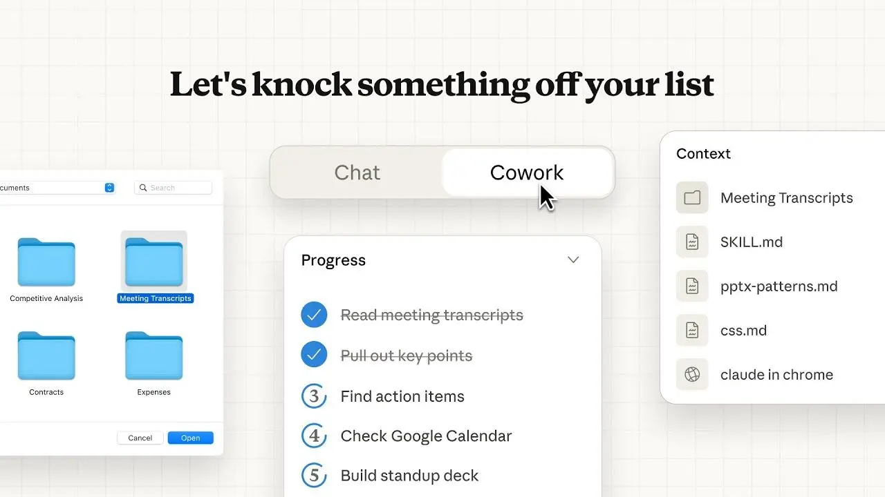
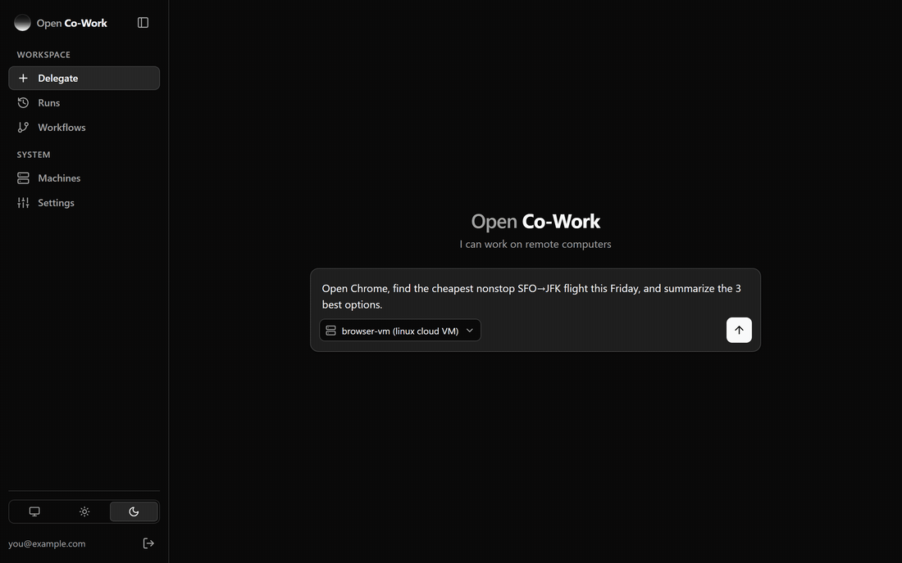

<p align="center">
  <a href="https://github.com/coasty-ai/open-cowork">
    
  </a>
</p>

<h1 align="center">open-cowork</h1>

<p align="center">
  <strong>Hand off computer tasks to an AI coworker — watch it work, approve from anywhere.</strong>
</p>

<p align="center">
  An open-source agentic coworker that <em>sees a screen and acts on it</em> — your own desktop,
  a cloud VM, or a browser. Bring your own LLM, or use Coasty's out of the box.
</p>

<p align="center">
  <a href="https://github.com/coasty-ai/open-cowork/actions"></a>
  
  
  
  
  
  
</p>

<p align="center">
  <a href="#quickstart"><b>Quickstart</b></a> &nbsp;·&nbsp;
  <a href="BYOK.md"><b>Bring your own LLM</b></a> &nbsp;·&nbsp;
  <a href="RUN_LOCALLY.md"><b>Automate your PC</b></a> &nbsp;·&nbsp;
  <a href="#what-it-does">What it does</a> &nbsp;·&nbsp;
  <a href="#how-it-works">How it works</a> &nbsp;·&nbsp;
  <a href="#docs">Docs</a>
</p>

<p align="center">
  
</p>
<p align="center">
  <sub><em>Delegate a task → watch it work, step by step → get the result. Runs with zero setup.</em></sub>
</p>

---

## Quickstart

> **Prereqs:** Node ≥ 22.5 · pnpm 10 (`corepack enable`)

```bash
git clone https://github.com/coasty-ai/open-cowork.git && cd open-cowork
pnpm install
pnpm desktop
```

**One command, zero config.** `pnpm desktop` starts the backend and web UI, then opens the
desktop app — the build that can drive **your own screen**. With no key set it runs in **demo
mode**: a bundled mock server and a throwaway sandbox key. No account, no network, no billing.

Then, in the window:

1. Sign in with any email.
2. On **Delegate**, pick **“This computer (local screen).”**
3. Type a task → confirm the cost → watch it work.

> ⚠️ Local control moves your **real** mouse and keyboard. Stop with **Cancel** or close the
> window. Start small — safety notes in **[RUN_LOCALLY.md](RUN_LOCALLY.md)**.

### Ways to run

| Goal | How | Cost |
| --- | --- | --- |
| **Automate your own PC** | `pnpm desktop` | demo **$0** · BYOK = your provider's rate |
| **Web app only** | `pnpm dev` → <http://127.0.0.1:5173> | **$0** |
| **Use your own LLM** | put a key in `.env`, or **Settings** | your provider's rate · **local = $0** |
| **Use your Coasty account** | add `COASTY_API_KEY` to `.env` | sandbox key = **$0** |

Everything has a working default. The only thing you might set is a key — and even that is
optional.

---

## Bring your own LLM

```bash
echo 'ANTHROPIC_API_KEY=sk-ant-…' >> .env
pnpm desktop
```

That's it. The desktop detects the key, picks a vision-capable model, and tells you what it
chose. Works the same with `OPENAI_API_KEY`, Gemini, xAI, Mistral, Groq, or OpenRouter — and
with **Ollama / LM Studio** for a model running entirely on your machine, no key and no cloud.

Because computer use is screenshot-driven, open-cowork verifies the model can actually **see**
before spending anything, using a bundled capability catalog of **1,105 vision-capable models**
distilled from two open databases, plus each provider's own metadata. A model that can't see images is blocked with a
clear message rather than sent a blind screenshot.

**→ Full guide: [BYOK.md](BYOK.md)** — every provider, local setup, capability resolution, and
the long-horizon guards that stop a wedged run in seconds instead of burning the step cap.

---

## What it does

- 💬 **Delegate in chat** — _"rename these files and email the report"_ — and watch it execute
  step by step with a live screen view.
- 🚀 **Zero-setup managed tasks** — hand over a goal with no machine at all; Coasty
  provisions a fresh VM, runs it fully autonomously, and destroys it afterwards. The
  model-input frames it saw outlive the machine, so you can always audit what happened.
- 🧠 **Any model** — Anthropic, OpenAI, Gemini, xAI, Mistral, Groq, OpenRouter, or a local
  model. Coasty is just the default.
- 📺 **Supervise runs** — durable event timeline (SSE with replay); cancel, resume, or take
  over from web, desktop, or phone.
- 🔁 **Build workflows** — a versioned JSON DSL (task · assert · if · loop · parallel · retry ·
  human_approval) with validation, cost estimates, and hard server-side budget caps.
- 🖥️ **Manage machines** — provision cloud VMs, snapshot, stop, terminate, with live rates.
- 📱 **Stay in the loop** — start a run on your laptop; when it pauses for approval, the banner
  pops on your phone.
- 💸 **See cost at all times** — wallet balance, worst-case estimates, and an explicit
  confirm-the-cost handshake before anything billable starts.

| Capability | 🖥️ Desktop | 🌐 Web | 📱 Mobile |
| --- | :---: | :---: | :---: |
| Local screen control | ✅ first-class | → cloud machine | → cloud machine |
| Managed task (no machine to set up) | ✅ | ✅ | view + monitor |
| Cloud-machine control + live view | ✅ | ✅ | ✅ |
| Task chat + run dashboard | ✅ | ✅ | ✅ |
| Workflow builder | ✅ full | ✅ full | view + approve |
| Approvals / human takeover | ✅ | ✅ | ✅ |

---

## How it works

```text
 You ──► open-cowork backend ──► Coasty API ──► a screen the agent drives
            │   (the ONLY place           ├─ your own desktop   (desktop app)
            │    the API key lives)       ├─ a Coasty cloud VM  (any client)
            │                             ├─ an ephemeral VM    (managed task —
            └──► web / desktop / mobile   │    made + destroyed for you)
                 live events, approvals,  └─ a browser page     (Playwright)
                 costs
```

One shared **agent loop** (screenshot → predict → act → repeat) drives any screen through a
single `Executor` interface — `LocalExecutor`, `RemoteMachineExecutor`, or `BrowserExecutor`.
The **predict** step is its own seam, so [your own LLM](BYOK.md) is just another implementation
behind the same contract; the loop, executors, and UI don't care which is behind it.

Clients never hold the API key: they talk to the backend with short-lived session tokens, and
the backend proxies to Coasty, verifies HMAC-signed webhooks, persists runs, and fans events
out over SSE. Full design in **[ARCHITECTURE.md](ARCHITECTURE.md)**.

## Security

`COASTY_API_KEY` exists **only** in the backend's environment — browsers, Electron renderers,
and the mobile app authenticate with short-lived session tokens and never see it. This is
enforced by tests that scan every client bundle and a runtime E2E assertion that watches every
browser request for secret material. BYO LLM keys follow the same rule, encrypted with your OS
keychain. Threat notes in **[SECURITY.md](SECURITY.md)**.

---

## Docs

| Guide | What's inside |
| --- | --- |
| **[RUN_LOCALLY.md](RUN_LOCALLY.md)** | Automate your own PC with the desktop app — step by step |
| **[BYOK.md](BYOK.md)** | Every provider, local models, capability resolution, long-horizon guards |
| [ARCHITECTURE.md](ARCHITECTURE.md) | Monorepo map, the Executor abstraction, agent loop, realtime + data model |
| [SECURITY.md](SECURITY.md) | Key custody, HMAC, trust boundary, threat table |
| [DEPLOYMENT.md](DEPLOYMENT.md) | Running the backend + each client in production |
| [COOKBOOK.md](COOKBOOK.md) | Recipes: cross-device approval, workflows, scripting the loop |
| [DECISIONS.md](DECISIONS.md) · [CONTRIBUTING.md](CONTRIBUTING.md) · [SUMMARY.md](SUMMARY.md) | Stack choices · how to contribute · what was built + coverage |

### Project layout

```text
packages/core       Coasty client, agent loop, workflow DSL, cost estimator, HMAC — isomorphic
packages/executor   Executor abstraction: LocalExecutor, RemoteMachineExecutor, BrowserExecutor
packages/llm        BYO LLM seam: any provider via the Vercel AI SDK (desktop-only)
packages/ui         Shared React design system + domain components
apps/backend        Fastify: auth, Coasty proxy (sole key holder), webhooks, SQLite, SSE
apps/web            Vite + React SPA (also hosted by the desktop shell)
apps/desktop        Electron shell + LocalRunManager (local screen control)
apps/mobile         Expo / React Native companion (monitor + approve)
tools/mock-coasty   Full offline mock of the Coasty API (REST + SSE + signed webhooks)
e2e                 Playwright end-to-end flows (web + desktop)
```

### Commands

| Command | What |
| --- | --- |
| `pnpm desktop` | full stack + the desktop app (local screen control) |
| `pnpm dev` | mock + backend + web (`--no-web` for API only) |
| `pnpm run doctor` | preflight: Node, deps, key shape, Electron binary |
| `pnpm fix:electron` | re-install Electron's binary if the desktop app won't start |
| `pnpm test` · `pnpm typecheck` · `pnpm lint` | offline checks, no spend |
| `pnpm e2e` | Playwright: web + desktop journeys vs the mock |
| `pnpm update:models` | refresh the model capability catalog |

---

## Links

- **Issues & feature requests:** <https://github.com/coasty-ai/open-cowork/issues>
- **Report a vulnerability:** [Security Advisories](https://github.com/coasty-ai/open-cowork/security/advisories) (see [SECURITY.md](SECURITY.md))
- **Coasty:** [docs](https://coasty.ai/docs) · [API keys](https://coasty.ai/developers/keys)

## License

[MIT](LICENSE) © Coasty / open-cowork contributors
